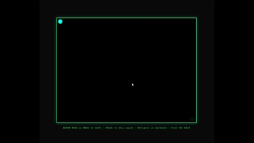

# Echo-Location

> A browser-based sonar puzzle game where you navigate a pitch-black maze using sound waves to see the walls.


## 🌟 Game Description

**Echo-Location** is an immersive puzzle survival game that challenges your spatial awareness and navigation skills. You're trapped in complete darkness within a mysterious maze. The only way to see your surroundings is by emitting sonar-like pulses that temporarily reveal the walls as they expand outward.

### Core Gameplay Features:

- 🗺️ **Procedurally Generated Mazes** - Every playthrough offers a unique challenge using the Recursive Backtracker algorithm
- 🌊 **Echolocation Mechanic** - Press SPACE to emit expanding pulse rings that illuminate walls
- 🎯 **Survival Challenge** - One touch of a wall means game over!
- 🚪 **Find the Exit** - Navigate through the darkness to reach the glowing green exit zone
- 🎨 **Minimalist Sonar Aesthetic** - Neon green pulses on pitch-black background

### Technical Highlights:

✅ Pure vanilla JavaScript - No external libraries or frameworks  
✅ HTML5 Canvas rendering with smooth `requestAnimationFrame` game loop  
✅ Real-time collision detection  
✅ Dynamic lighting system based on pulse proximity  
✅ Responsive keyboard controls (WASD + Arrow Keys)  

## 🎯 How to Play

### Controls:

| Key | Action |
|-----|--------|
| **Arrow Keys** or **WASD** | Move your character |
| **SPACE** | Emit echolocation pulse |
| **R** | Restart game (after game over or victory) |

### Objective:

1. Navigate through the pitch-black maze
2. Use pulses sparingly to reveal walls
3. Avoid touching any walls (instant game over!)
4. Find and reach the green exit zone

## 🚀 Setup & Installation

### Prerequisites:

- A modern web browser (Chrome, Firefox, Safari, Edge)
- Git installed on your system

### Clone the Repository:

```bash
# Clone the repository
git clone https://github.com/GlyphicGuy/mini-arcade-games.git

# Navigate to the project directory
cd mini-arcade-games
```

### Start Playing:

#### Option 1: Direct File Open (Simplest)
1. Navigate to the `mini-arcade-games` folder
2. Double-click `echo-location.html`
3. The game will open in your default browser
4. Start playing immediately! 🎮

#### Option 2: Using a Local Server (Recommended for Development)

If you prefer running a local server:

**Using Python 3:**
```bash
# Navigate to the game directory
cd mini-arcade-games

# Start a simple HTTP server
python3 -m http.server 8000

# Open your browser and go to:
# http://localhost:8000/echo-location.html
```

**Using Node.js (with npx):**
```bash
# Navigate to the game directory
cd mini-arcade-games

# Start a simple HTTP server
npx http-server -p 8000

# Open your browser and go to:
# http://localhost:8000/echo-location.html
```

**Using VS Code Live Server Extension:**
1. Install the "Live Server" extension in VS Code
2. Right-click on `echo-location.html`
3. Select "Open with Live Server"

## 📁 Project Structure

```
mini-arcade-games/
│
├── echo-location.html      # Main HTML file (entry point)
├── echo-location.css       # Styling and visual effects
├── echo-location.js        # Game logic and mechanics
├── SETUP.md               # This file
└── README.md              # Project overview
```

## 🎨 Game Mechanics Explained

### The Darkness System
The entire canvas is rendered black by default. Walls exist but are invisible until illuminated.

### Echolocation Pulses
- Pulses expand from your current position as circular rings
- They fade out as they grow, eventually disappearing
- Walls are only drawn when a pulse ring passes over them
- This creates a realistic "sonar" effect

### Collision Detection
- The game uses grid-based collision detection
- Each cell of the maze has four potential walls
- Player movement is checked against all nearby walls
- Collision = instant game over (harsh but fair!)

### Maze Generation
- Uses the **Recursive Backtracker** algorithm
- Guarantees a perfect maze (one path between any two points)
- Creates a solvable path from start to exit
- Randomly generated each time you restart

## 🎓 Tips & Strategies

💡 **Pulse Management**: Emit pulses frequently enough to navigate, but remember each pulse takes time to expand  
💡 **Memory Mapping**: Try to remember the maze layout as pulses reveal it  
💡 **Slow and Steady**: Don't rush! Careful movement is better than speed  
💡 **Corner Caution**: Corners are the most dangerous - emit extra pulses  
💡 **Follow the Walls**: Sometimes hugging a wall (carefully!) can help navigate  

## 🛠️ Customization

Want to modify the game? Here are some easy tweaks you can make in `echo-location.js`:

```javascript
const CONFIG = {
    CANVAS_WIDTH: 800,        // Canvas width in pixels
    CANVAS_HEIGHT: 600,       // Canvas height in pixels
    CELL_SIZE: 40,           // Maze cell size (smaller = harder)
    PLAYER_RADIUS: 8,        // Player size
    PULSE_SPEED: 3,          // How fast pulses expand
    PULSE_MAX_RADIUS: 250,   // Maximum pulse radius
    // ... and more!
};
```

## 🎮 Enjoy the Game!

Now that you're all set up, dive into the darkness and master the art of echolocation! Can you find the exit without hitting a wall?

**Good luck, and may your pulses guide you! 🌊✨**

---

## Demo Gameplay

